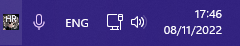
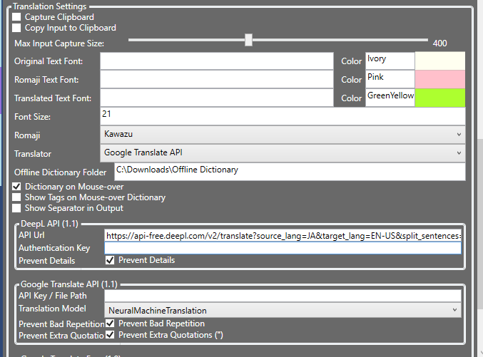
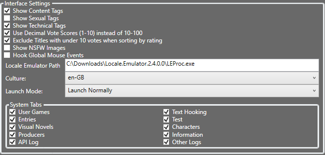
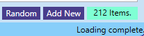
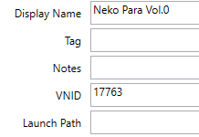
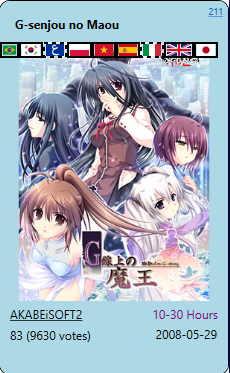
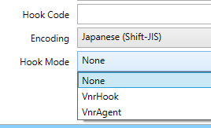
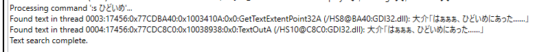
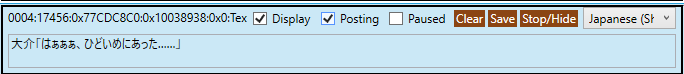
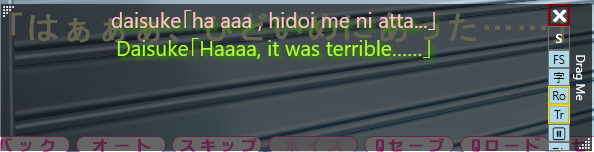

# Happy Reader
WPF Program to search for data from VNDB.org via API and data dump files, also a 'game launcher' for visual novels with ability to extract text from visual novels and translate to English on-the-fly, using translation APIs and user-entered text substitutions.
Has 'mouseover dictionary' functionality for Japanese text in output window.
  
Supported by [JetBrains](https://www.jetbrains.com/?from=HappyReaderByZoltanar)

Before reporting issues or requesting features, please see [Goals](https://github.com/Zoltanar/Happy-Reader/blob/master/Goals.md)

# Basic Guide (Latest Committed)

- Launch Happy Reader.exe  
- (To close the application, you must right click the icon in the Windows tray section, next to the time)

- Click on the settings Icon ⚙️ in the bottom left

- Change Translator to use and enter/modify settings as needed.

- Enter path to Locale Emulator if required (LEProc.exe)

- Go to `Games` tab on the left
- Drag executable to area in `Games` tab, or click `Add New` to select executable

- A Game tab will open, you can access this later via double-click or 'right-click > See Details' on game in Games tab
- If this is a game found on VNDB, Happy Reader will try to find a match, if it fails or is incorrect, you can change this by changing the `VNID` value to that of the correct visual novel, you must press `Enter` to save your change

- You can search for the VN in the Visual Novels tab, the ID can be found in the top right corner of VN tiles

- Change `Hook Mode` as necessary (usually `VnrHook`)
- Enter /H Hook Code if available

- Back on `Games` Tab, launch Game by clicking `Off` button, or right-click and choose specific launch mode
- The game must be launched from Happy Reader itself at least once, before it can be automatically found when started outside Happy Reader
- If you get an 'Access Denied' error, you may need to run Happy Reader as Administrator.
- In launched game, progress to dialog section
- It is highly advised that you change the text speed in game to the maximum, to prevent text being broken up or repeated
- Back on Happy Reader, switch to `Text Hooking` tab
- Look for dialog text in the text thread panels or
- use the command `:s` or `:sa` followed by the text to search for Happy Reader to search for the text
  - example: `:s おはよう！` to search for `おはよう！` in each text thread, in the encodings that each thread is set to
  - example: `:sa おはよう！` to search for `おはよう！` in each text thread, in all 3 encodings possible (Unicode, UTF-8, Shift-JIS) (can take longer)
  - Results will appear in Console thread at the top
  - If \:sa is used and text is is a different encoding to the one selected in text thread panel, you can change the encoding with the drop-down on the right or use the following command to change the encoding of all panels
  
- use the command `:e <encoding>` to switch the encoding of all text thread panels to the desired one.
  - example: `:e Unicode` to switch all panels to Unicode
  - example: `:e Shift-JIS` to switch all panels to Shift-JIS
  - example: `:e UTF-8` to switch all panels to UTF-8
- On the relevant text thread panel, check the `Posting` checkbox, to allow text to appear in Output Window.
- 
- Advance in game to next dialog
- A window should pop up on top of the Game Window

  - If it does not, it may have appeared out of screen, click `Reset Output Window` in Text Hooking tab to reset it to a visible location
  - If it still does not appear, click `Show Output Window` in Text Hooking tab.  

- Window should contain captured text (by default, romaji and Translation is shown)
- Change location, size, and settings of Output Window to your preference
  - Output Window stays on top and will re-appear if closed when new text is captured
- At this point, everything should be ready to go, you can stop/hide other text threads to save memory and increase performance:
  - use 'Stop/Hide' buttons in each text thread panel or
  - Select the `Posting` panel (click on thread name and not text box) then click `Toggle Display Others`/`Toggle Post Others`/`Toggle Pause Others` or
  - You can also click `Clear Others` to clear existing text from threads other than selected or
  - You can click `Ignore Other Threads` if you are sure that no other text threads are required
- Note: in some games, the text thread identifiers change every time it is launched, when this is the case and you have identified a hook code, it is best to save this hook code to the game, and check the `Capture By Hook Code` option, to automatically post text from threads matching that hook code instead of using thread identifiers to store user settings.
- Play game
- Settings for which thread to capture should be saved so next time you launch the game, you should not have to set them up again.

#### Entries (Custom Text Replacement)

The user can add custom text replacements to assist translation, this can be especially useful with regards to character names.
Entries can be added in different ways
1. Entries Tab: Select `Entries` tab and click `Add Entries`
2. Select text in Output Window and `right-click > Add Entry for Text`
3. Import Names from VNDB title.  

Once in the Add Entries tab, you can change various parameters.  
Example of a name substitution:  
`Type=Name, Game=User or VNDB Game Name, Role=m, Input=桜子, Output=Ouko, Series-Specific=True.`  
These can be tested in the `Test` tab.  
Entries of type Name and Translation use `Proxy` entries, which will be used in the translation process.  
The text in the entry's `Role` dictates what kind of proxies to use.  
If the entry has Role `m`, it will try to use a Proxy with role `m`.
Some proxies will be created by default but more may be needed if a sentence has a lot of separate names.  
These can be added by creating entries of type `Proxy` which have an output that should match what a translator returns, when the input is provided.  
This can be text that is unlikely to be changed by the translators such as `ZBXC > ZBXC`  
or proper nouns without many alternative readings, which can help with context,  
like `由紀子>Yukiko`, as it is a female name, it should return translation in a female context.  
By creating proxies with specific Roles (like the above with role `m.f`) and then creating entries that use said roles (`アリス>Arisu with role m.f`), translation quality should improve.  
Proxy Role suggestions:
- m = Name
- m.f = Female Name (defaults to `m` if `m.f` proxies are not found)
- n = Non-Name Noun (objects, etc)

#### Mouseover Dictionary

There is functionality to display definition of Japanese Kanji/words when placing the mouse over such text in the following panels:
1. Text Thread Panels in Text Hooking tab
2. Original panel in Test tab
3. Original text in Output Window

This can be enabled in the Settings tab (`Dictionary on Mouse-over`), a path to the folder with the dictionary files must be entered.
You can download these files from the releases page but they must be extracted before they can be used.

#### VNDB Integration

If the user wishes, they may use the VNDB integration features, such as 
- browsing data from VNDB, 
- filtering titles and characters by many different properties, 
- Adding Producers to a 'Favorite Producers' list to easily find titles/characters by them.
- Change labels on titles from Happy Reader
- importing character names to 'Entries' list
- match games added to titles in database  

In order to use these features, the user must run the `DatabaseDumpReader.exe` application,  
which will download files with all the VNDB information (around 100MB).  
Before you run this application, you can log in with your VNDB credentials in Happy Reader's settings tab,  
this will ensure information about the user's labeled titles and votes is saved to the local database.  
The user can also save all VNDB images and keep it synced, by changing the Image Sync options,  
select the corresponding image types, the Screenshots type is the largest one at around 17GB, see https://vndb.org/d14 for more information.  
Screenshot thumbnails are used as a fallback when full-size screenshots are not found.  
After changing the settings as preferred, close Happy Reader and then run DatabaseDumpReader, this can take a few minutes (5~10).  
After it finishes, launch Happy Reader again and you should see VNDB data in Visual Novels and Characters sections.  
You can filter this information by clicking `Filters` in the right, a permanent filter can be set that will always be active, and you can also create custom filters to switch through.

Translation Plugins can be created by inheriting from ITranslator interface in Happy_Apps_Core and placed (along their dependencies) in Translation Plugins folder which lies beside Happy Reader.

Personal settings and VNDB data is saved to `%appdata%/Happy Reader`  
VNDB Password is encrypted and saved to Windows Registry at `HKEY_CURRENT_USER\SOFTWARE\Happy Reader`
